<!-- hero: monochrome ASCII portrait (types in) beside the extruded 3d ascii
     wordmark (wipes in left-to-right, then rocks on its vertical axis).
     portrait: drop source-photo.jpg → python scripts/prep_photo.py && python scripts/make_ascii_svg.py
     wordmark: python scripts/make_wordmark_svg.py --mode rock --out wordmark.svg -->

<h3><code>vaibhav@github ~ $ whoami</code></h3>

<table>
<tr>
<td valign="top"></td>
<td valign="top"></td>
</tr>
</table>

 
 

<!-- animated contribution graph: real data, boxes reveal cell by cell
     (regenerated daily by .github/workflows/update-profile-art.yml) -->

<h3><code>vaibhav@github ~ $ ./contributions.sh</code></h3>

 
 

<h3><code>vaibhav@github ~ $ ./links.sh</code></h3>

  <b>🚀 MERN Stack Developer</b>  
  
  
  
  
  
  

<!-- -->

 
  

